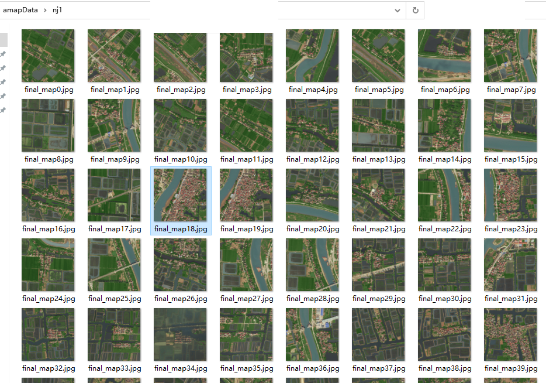

# BaiduTiles_byGCJ
download Baidu 19-level map by GCJ coordinates

China (e.g. Amap) use GCJ-02 coordinates, while Baidu has its own BD-09 format. 

The code

bdLon, bdLat = calTiles.gcj2bd(118.984728,31.284715)  # input GCJ lon, lat

converts  GCJ-02 to BD-09 coordinates.  Comment out the line if you already has  BD-09 coordinates.

baiduTiles.py download a map (made of 25 tiles from Baidu API) for a given GCJ coordinates.

Configure the number of tiles by setting, e.g., dd=3  to obtain a map of 49 tiles. number = (2*dd+1)^2.

baiduTiles.py download multiples maps from a list of GCJ coordinates in an excel table.

