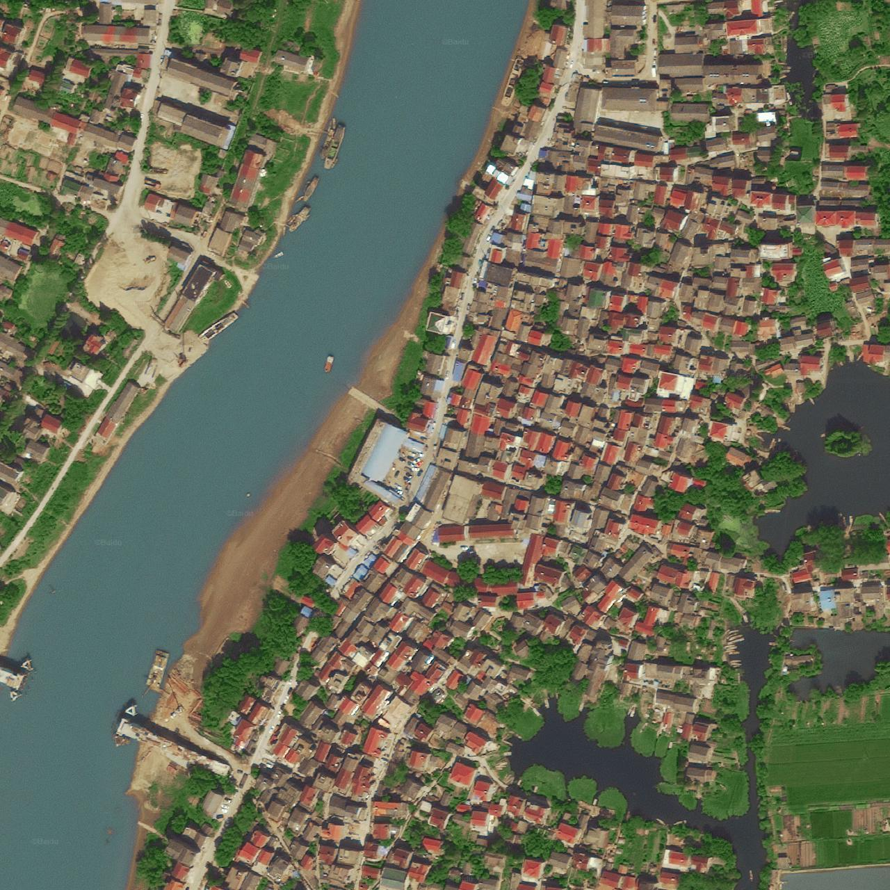

# BaiduTiles_byGCJ
download Baidu 19-level map by GCJ coordinates

baiduTiles.py download a map (made of 25 tiles from Baidu API) for a given GCJ coordinates. Configure the number of tiles by setting e.g.

dd=3

to obtain a map of 49 tiles. number = (2*dd+1)^2.

baiduTiles.py download multiples maps from a list of GCJ coordinates in an excel table.

